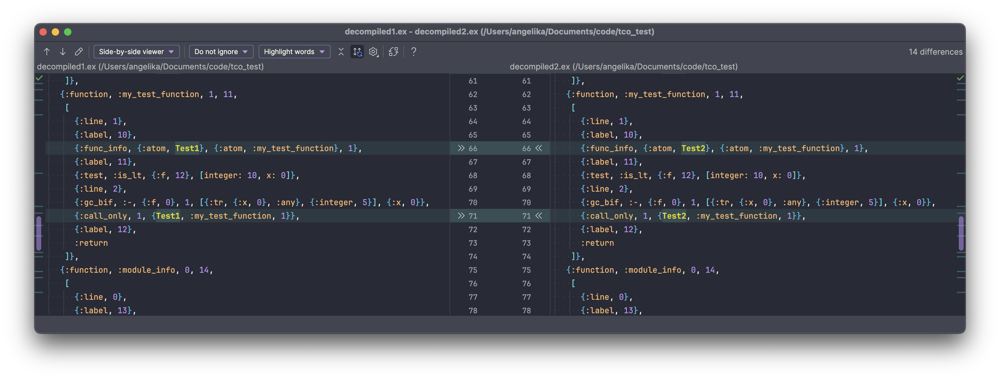

# Do `case` and multiple clause functions compile to the same VM instructions?

Answer: yes.

## Proof

I'm creating two modules, both implement a `my_test_function` function that only differs between the two modules with one detail: one implementation uses a `case` expression, and the other multiple clause functions.

### Compiling

```bash
$ elixirc test1.ex
$ elixirc test2.ex
```

### Decompiling

```elixir
file1 = File.read!("./Elixir.Test1.beam")
decompiled1 = :beam_disasm.file(file1)
File.write!("./decompiled1.ex", Macro.to_string(decompiled1))

file2 = File.read!("./Elixir.Test2.beam")
decompiled2 = :beam_disasm.file(file2)
File.write!("./decompiled2.ex", Macro.to_string(decompiled2))
```

Format decompiled files:

```bash
$ mix format decompiled1.ex
$ mix format decompiled2.ex
```

### Diff

After compiling the two modules to BEAM files and then decompiling, the implementations of the two functions are identical. Thus is it my conclusion that `case` and multiple clause functions are equivalent after compiling.


